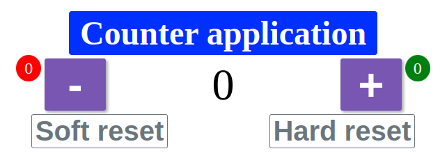

[![Issues][issues-shield]][https://github.com/matteorazzanelli/simple-js-counter/issues]
[![LinkedIn][linkedin-shield]][https://linkedin.com/in/m-minerva]

<!-- PROJECT LOGO -->
<br />
<div align="center">
  
  <h3 align="center">Simple Counter</h3>
  <p align="center">Project created for Beginner Javascript Super Guide</p>
</div>

<!-- TABLE OF CONTENTS -->
<details open="open">
  <summary>Table of Contents</summary>
  <ol>
    <li><a href="#about-the-project">About The Project</a></li>
    <li><a href="#getting-started">Getting Started</a></li>
    <li><a href="#usage">Usage</a></li>
    <li><a href="#contact">Contact</a></li>
    <li><a href="#acknowledgements">Acknowledgements</a></li>
  </ol>
</details>

<!-- ABOUT THE PROJECT -->
## About The Project

Simple application that works as a counter.

General requirements:

- Develop a JavaScript application that allows the user to increment and decrement the counter value;
- The user will display 0 as the counter value;
- Thanks to 2 buttons (+/-) buttons available to change the counter value;
- The user is also able to perfomr a soft or hard reset.

Technical requirements:
- The application must be developed with JavaScript.
- The use of external JavaScript libraries is allowed, if necessary.
- The +/- buttons, and also the counter value display must be implemented with JavaScript.

<!-- GETTING STARTED -->
## Getting Started

1. Clone the repo

```sh
git clone https://github.com/matteorazzanelli/simple-js-counter
```

2. Launch `index.html` with your favorite browser.

<!-- USAGE -->
## Usage

Hitting the `+` button will increment the counter value and `-` will decrement it.
The value can go below `0`.
Hitting `Soft reset` the user will be able to reset the counter only.
Hitting `Hard reset` the user will be able to reset the counter as well the notifications.

<!-- CONTACT -->
## Contact

Matteo Razzanelli - matteo.razzanelli89@gmail.it

start2impact personal page: https://talent.start2impact.it/profile/matteo-razzanelli

<!-- ACKNOWLEDGEMENTS -->
## Acknowledgements


<!-- MARKDOWN LINKS & IMAGES -->
<!-- https://www.markdownguide.org/basic-syntax/#reference-style-links -->

[issues-shield]: https://img.shields.io/github/issues/matteo-minerva/simple-counter/repo.svg?style=for-the-badge
[issues-url]:
[linkedin-shield]: https://img.shields.io/badge/-LinkedIn-black.svg?style=for-the-badge&logo=linkedin&colorB=555
[linkedin-url]: 
[product-screenshot]: /screenshot.png